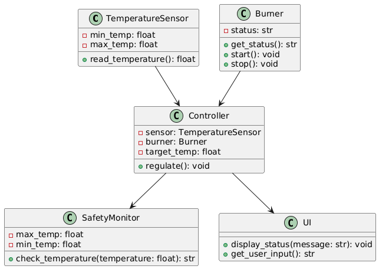
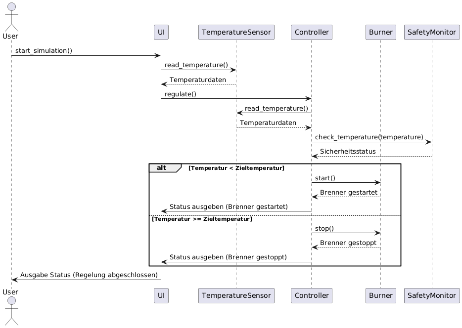
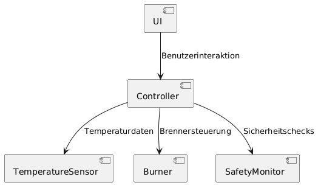

# Software Engineering, Heizung – Brennersteuerung

## Genereller Plan

### Teilfunktionalitäten
- Temperaturmessung:  
Simulation eines Sensors zur Erfassung der Kesseltemperatur

- Sollwertregelung:  
Vergleich zwischen Ist- und Solltemperatur, Steuerung des Heizbetriebs

- Brennersteuerung:  
Steuerlogik: Ein-/Ausschalten des Brenners

- Sicherheitsüberwachung:  
Notabschaltung bei Fehlfunktionen (Übertemperatur, Sensorfehler)

- Benutzeroberfläche:  
Einfaches GUI zur Anzeige und Einstellung von Parametern

### Iterative Vorgehensweise
- Iteration 1
  - Temperaturmessung + Regelung + Brennerstatus
  - Ausgabe auf der Konsole
- Iteration 2
  - Einführung von Checks bzw. Fehlerbehandlung
  - Visualisierung
- Iteration 3
  - Vollständige UI
  - Tests

## Phasen des Software Engineering

### Requirement Engineering
- Funktionale Anforderungen
  - REQ-F01 - Umgebungstemperatursimulation  
    Das System simuliert die Umgebungstemperatur im Sekundentakt
  - REQ-F02 - Sollwerteingabe  
    Der Benutzer kann einen Sollwert eingeben
  - REQ-F03 - Automatisierte Brennerschaltung  
    Die Steuerlogik schaltet den Brenner bei Bedarf ein/aus
  - REQ-F04 - Sicherheitsmodul  
    Ein Sicherheitsmodul erkennt Grenzüberschreitungen
  - REQ-F05 - UI  
    Das UI zeigt Ist-, Soll- und Brennerstatus an
- Nicht-funktionale Anforderungen
  - REQ-NF01 - Universelle Lauffähigkeit  
    Die Software ist auf Windows und Linux lauffähig
  - REQ-NF02 - Reaktionszeit  
    Die Reaktionszeit auf Temperaturveränderung beträgt max. 2 s
  - REQ-NF03 - Testbarkeit  
    Die Software ist testbar mit Unit-Tests
  - REQ-NF04 - Sauberer Code  
    Lesbarer Code mit PEP8-Konformität

### Software Architektur
Schichtenarchitektur
- Präsentation: Ausgabe der Simulation
- Logik: Regelung/Steuerung
- Daten: Sensor-Simulation

### Software Design
Jede Hauptfunktionalität wird als Modul entworfen und getestet.  
Module: `sensor`, `control`, `safety`, `burner`, `ui`

### Implementierung
- Programmiersprache: Python
- Git für Versionskontrolle (öffentlich auf GitHub)
- Branches für Iterationen
- pytest für Unit-Tests (leichter als unittest)
- draw.io für Architektur/Diagramme

### Software Test
- Unit-Tests: Automatisiertes Testen einzelner Komponenten
- Integrationstests: Überprüfung des Zusammenspiels der Module.
